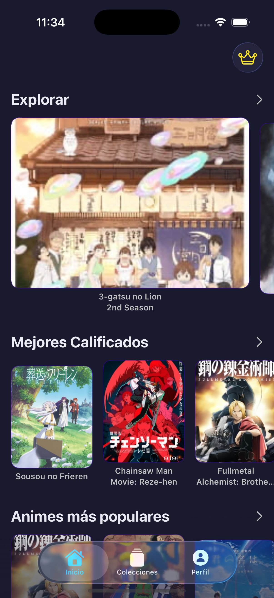
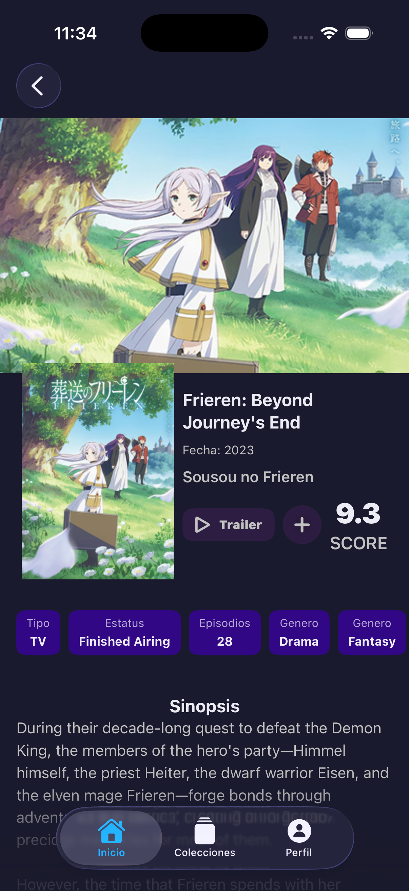
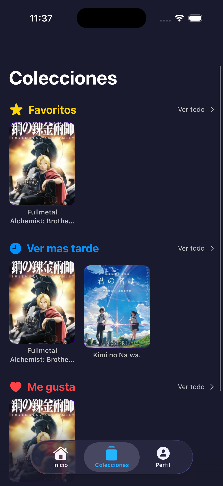
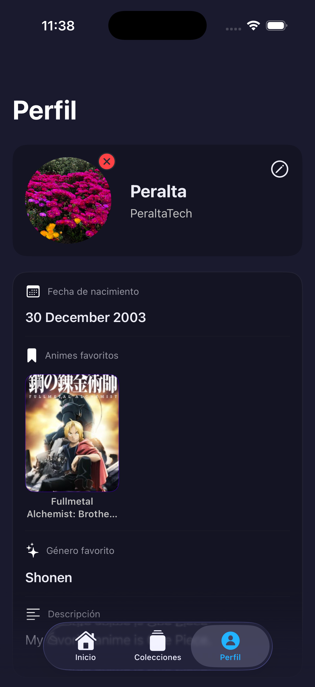

# 🌸 AnimeTier

**AnimeTier** es una aplicación nativa de iOS desarrollada en **SwiftUI** diseñada para los amantes del anime.  
Permite descubrir nuevos títulos, consultar detalles, ver trailers y organizar tus series favoritas en colecciones personalizadas utilizando la persistencia de datos moderna de Apple.


---

## 📱 Capturas de Pantalla (Screenshots)

| Inicio | Detalles | Colecciones | Perfil |
|:---:|:---:|:---:|:---:|
|  |  |  |  |


---

## ✨ Características Principales

- **🔍 Exploración:** Descubre animes clasificados por *Mejores Calificados*, *Más Populares* y *Recientes* consumiendo la API de Jikan.
- **💾 Persistencia Local (SwiftData):** Guarda tus animes en listas personalizadas:
  - ⭐ Favoritos
  - 🕒 Ver más tarde
  - ❤️ Me gusta
- **👤 Perfil de Usuario:** Personaliza tu perfil con foto (usando `PhotosUI`), apodo, biografía y género favorito.
- **📺 Detalles y Media:** Visualización de sinopsis, puntuación, año, género y enlace directo al trailer en YouTube.
- **🎨 UI Personalizada:** Diseño moderno con tema oscuro **Night Sakura** y componentes visuales atractivos.
- **💎 Vista de Suscripción:** Interfaz para planes Premium (Mensual y Anual).

---

## 🛠 Stack Tecnológico

- **Lenguaje:** Swift  
- **Framework UI:** SwiftUI  
- **Arquitectura:** MVVM (Model-View-ViewModel)  
- **Base de Datos:** SwiftData (iOS 17+)  
- **Networking:** URLSession + Async/Await  
- **API Externa:** [Jikan API v4](https://jikan.moe/) (Unofficial MyAnimeList API)  
- **Frameworks Adicionales:**
  - `PhotosUI` – Selección de imágenes
  - `LocalAuthentication` – Seguridad biométrica (Face ID)

---

## 📂 Estructura del Proyecto

El proyecto sigue una arquitectura limpia separando responsabilidades:

```text
AnimeTier/
├── App/
│   ├── AnimeTierApp.swift       # Entrada principal y configuración del Container
│   └── AppRoutes.swift          # Gestión de navegación
├── Models/                      # Modelos de SwiftData y DTOs
│   ├── AnimeEntry.swift         # Modelo persistente (@Model)
│   ├── AnimeDTO.swift           # Decodificación JSON (Codable)
│   └── EntrysAuxiliar.swift     # Modelos auxiliares (Images, Genres)
├── ViewModels/                  # Lógica de negocio (@Observable)
│   ├── HomeViewModel.swift      # Lógica de fetch y autenticación
│   ├── AddAnimeViewModel.swift  # Gestión de colecciones
│   └── ...
├── Views/                       # Interfaz de Usuario
│   ├── Home/                    # Vistas principales (Carruseles, Grids)
│   ├── Detail/                  # Vista de detalle y estadísticas
│   ├── Collections/             # Listas de guardados
│   └── Profile/                 # Edición de usuario
└── Services/
    └── NetworkManager.swift     # Capa de red Singleton
